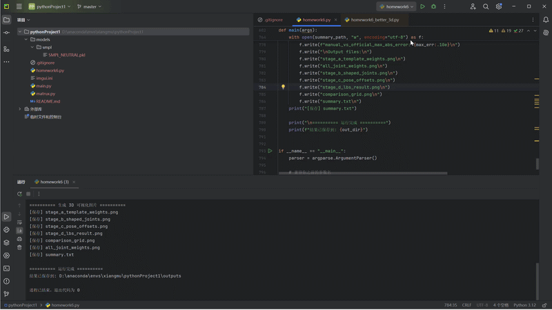

# SMPL LBS 可视化实验

本项目基于 SMPL 模型完成一次完整的 LBS（Linear Blend Skinning）蒙皮过程可视化，主要展示模板网格、蒙皮权重、形状校正、姿态校正以及最终 LBS 结果。

## 运行环境

本项目使用的 Python 版本为：

```bash
Python 3.12
```

主要依赖库包括：

```bash
numpy
scipy
matplotlib
torch
smplx
```

如果缺少依赖，可以使用：

```bash
pip install numpy scipy matplotlib torch smplx
```

## SMPL 模型文件说明

由于 `SMPL_NEUTRAL.pkl` 文件较大，且属于 SMPL 官方模型文件，因此没有上传到 GitHub 仓库中。

运行代码前，需要自行准备 SMPL 模型文件，并放置到以下目录：

```text
models/
└── smpl/
    └── SMPL_NEUTRAL.pkl
```

也就是说，完整路径应为：

```text
models/smpl/SMPL_NEUTRAL.pkl
```

## 运行方式

在项目根目录下运行：

```bash
python homework6_better_3d.py --model-path models --out outputs
```

其中：

```text
--model-path models    指定 SMPL 模型所在目录
--out outputs          指定结果输出目录
```

运行完成后，会在 `outputs/` 目录下生成实验结果，包括：

```text
stage_a_template_weights.png
all_joint_weights.png
stage_b_shaped_joints.png
stage_c_pose_offsets.png
stage_d_lbs_result.png
comparison_grid.png
summary.txt
```

## 效果展示

下面是实验结果的 GIF 展示：



## 实验内容

本实验主要完成以下内容：

1. 加载 SMPL 模型并输出基础信息；
2. 可视化模板网格和单关节蒙皮权重；
3. 计算并可视化形状校正后的网格和关节回归结果；
4. 计算并可视化姿态相关校正 `pose_offsets`；
5. 手写实现 LBS，得到最终蒙皮结果；
6. 生成四阶段对比图；
7. 输出 `summary.txt` 记录模型信息和误差结果。
